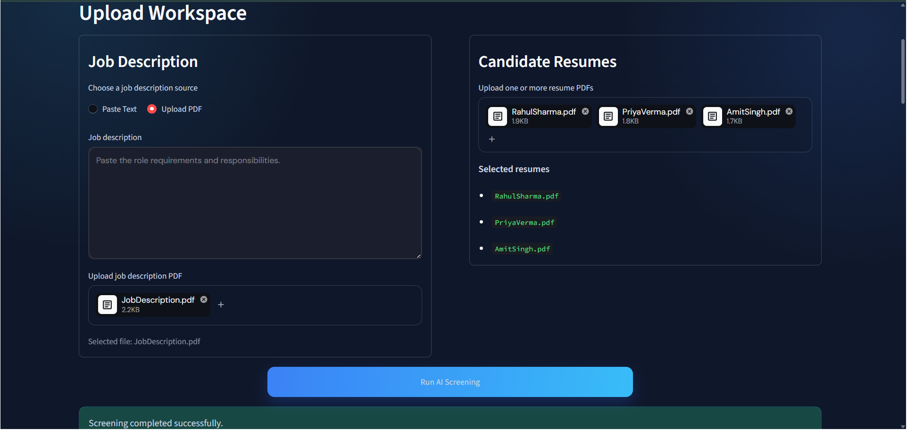
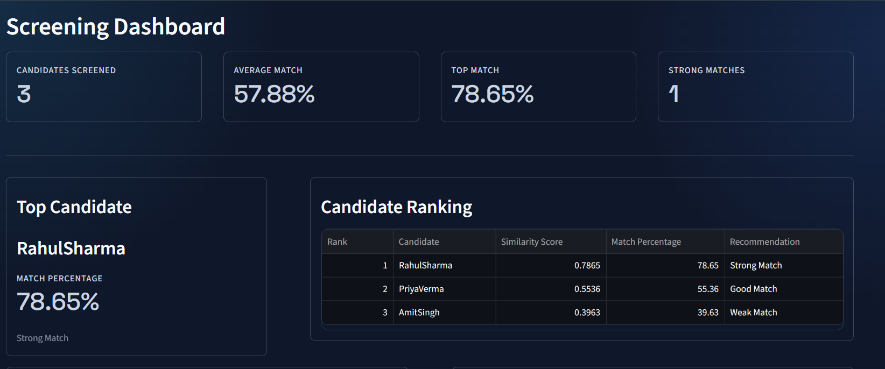
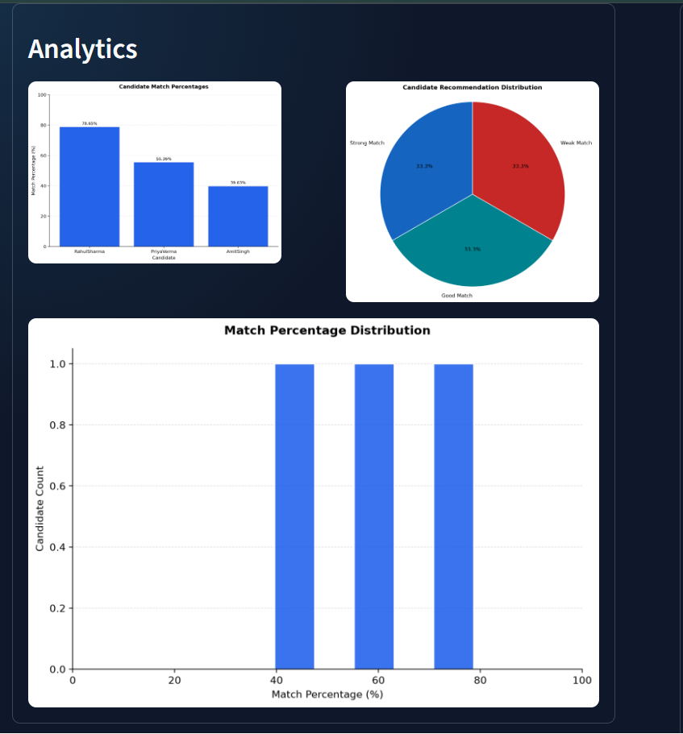
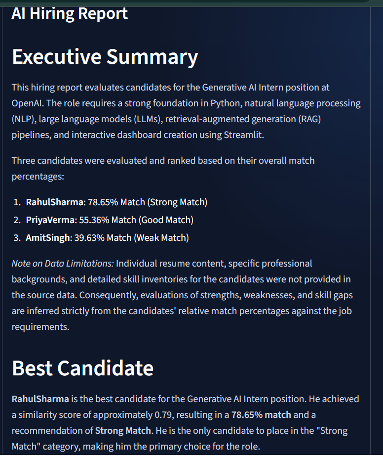

# 📄 Resume Screening AI

An AI-powered Resume Screening System that automatically ranks resumes based on their similarity to a Job Description using Natural Language Processing (NLP), Machine Learning, and Google's Gemini LLM.

Built using **Python**, **Streamlit**, **Sentence Transformers**, **Scikit-learn**, and **Gemini AI**.

---
# 🚀 Features
- 📄 Upload Job Description (PDF)
- 📑 Upload Multiple Resume PDFs
- 🤖 AI-powered Resume Screening
- 📊 Candidate Ranking Dashboard
- 📈 Interactive Analytics
- 🎯 Similarity Score Calculation
- 🥇 Automatic Candidate Ranking
- 💡 AI Hiring Report (Gemini API)
- 📥 Export Results to CSV
- 🎨 Clean Streamlit Interface

---
# 🛠️ Tech Stack
### Programming Language
- Python 3
### Frontend
- Streamlit
### AI & NLP
- Google Gemini API
- Sentence Transformers
- Scikit-learn
- TF-IDF Vectorization
- Cosine Similarity
### Data Processing
- Pandas
- NumPy
### Visualization
- Matplotlib
- Plotly
### PDF Processing
- PyMuPDF (fitz)
### Environment
- python-dotenv

---
# 📂 Project Structure

```
ResumeScreening-AI/
│
├── assets/
│   ├── logo.png
│   └── styles.css
│
├── modules/
│   ├── embedding_model.py
│   ├── llm.py
│   ├── pdf_parser.py
│   ├── preprocessing.py
│   ├── ranking.py
│   ├── screening.py
│   ├── similarity.py
│   ├── skills.py
│   ├── utils.py
│   └── visualization.py
│
├── uploads/
|__screenshots/
├── sample_data/
├── app.py
├── requirements.txt
├── .env
└── README.md
```
---
## 📷 Screenshots

### Dashboard



### Candidate Ranking



### Analytics



### AI Hiring Report


---
# ⚙️ Installation
Clone the repository
```bash
git clone https://github.com/krishhhXcode/ResumeScreening-AI.git
```
Move into the project
```bash
cd ResumeScreening-AI
```
Create virtual environment
```bash
python -m venv .venv
```
Activate virtual environment
### Windows
```bash
.venv\Scripts\activate
```
Install dependencies
```bash
pip install -r requirements.txt
```
Run the application
```bash
streamlit run app.py
```
---

# 🔑 Gemini API Setup
Create a `.env` file in the project root.
```
GEMINI_API_KEY=YOUR_API_KEY
```
Without an API key, the Resume Screening and Analytics will still work, but the AI Hiring Report feature will be unavailable.
---

# 📊 Workflow

1. Upload Job Description (PDF)
2. Upload Multiple Resume PDFs
3. Click **Run AI Screening**
4. AI extracts text from PDFs
5. Text is preprocessed
6. Resume embeddings are generated
7. Similarity scores are calculated
8. Candidates are ranked
9. Dashboard analytics are displayed
10. Download CSV report or generate AI Hiring Report
---

# 📈 Output
The application provides:
- Candidate Rankings
- Match Percentage
- Similarity Score
- Hiring Recommendation
- Interactive Charts
- CSV Export
- AI Hiring Report (Gemini)
---

# 🎯 Future Improvements
- Skill Gap Analysis
- Resume Keyword Highlighting
- Support for DOCX files
- Batch Report Generation
- ATS Score Prediction
- Multi-language Resume Support
---

# 👨‍💻 Author

**Krish Gupta**
B.Tech Information Technology
Shri Ramswaroop Memorial College of Engineering & Management
(SRMCEM), Lucknow

GitHub: https://github.com/krishhhXcode
---

# 📜 License
This project is developed for educational and internship purposes.